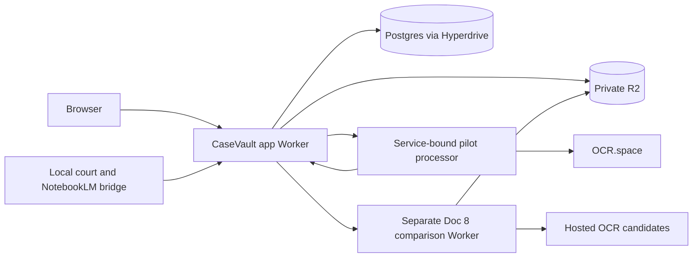

# System overview

Understand service boundaries and the evidence flow.

[Wiki home](../README.md) · [Verification baseline](../history/baseline-2026-10-04.json)

Reviewed against local files on **2026-10-04 (America/Chicago)** at `dbed6304a7d5` plus the recorded working changes. This is static review; deployed state and external availability were not rechecked.

## Contents

- [Runtime and data flow](#runtime-and-data-flow)
- [Processing boundaries](#processing-boundaries)
- [Access and trust boundaries](#access-and-trust-boundaries)
- [Evidence invariants](#evidence-invariants)
- [Sources](#sources)

## Runtime and data flow

CaseVault 2 is a Next.js 16 / React 19 evidence workspace deployed through OpenNext to Cloudflare Workers. The app reads structured records from Supabase Postgres through Hyperdrive and original files from private R2. Dependency versions are recorded in the [package manifest](../../package.json) and lockfile.

The [app configuration](../../wrangler.jsonc) binds `EVIDENCE`, `HYPERDRIVE`, `PROCESSOR`, `OCR_COMPARISON`, and `WORKER_SELF_REFERENCE`; it retains a legacy KV binding. Bindings describe intended wiring, not evidence of a current deployment.

## Processing boundaries

| Component | Responsibility | Execution boundary |
| --- | --- | --- |
| App | Intake, metadata, owner authentication, provider/agent configuration, pilot approval and AI drafts | Next.js routes and server libraries |
| Pilot processor | Hash-verified PDF extraction; OCR for insufficient body text | Service-bound Worker; scheduled tick delegates claims to the app |
| Source bridge | NYSCEF acquisition and NotebookLM reconciliation/delivery | Operator machine, outbound authenticated requests, consumer sessions remain local |
| Standalone OCR Worker | Bounded Llama/Moondream page-image transcription | Experimental implementation; separate deployment was blocked in historical records |
| Doc 8 comparison | Ten hosted candidates, page receipts, PDF publication and draft analysis | Fixed document 1008; independent R2 ledger, not the database pilot queue |

The early architecture statement “no processing runner” is superseded by the pilot implementation. The general extraction backlog still has no authorized broad execution established by these docs. See [intake and processing](../processing/intake-and-processing.md).

## Access and trust boundaries

The [request proxy](../../src/proxy.ts) accepts the machine token or validates the configured Google owner through Supabase `getUser()`. [Authorization](../../src/lib/auth.ts) checks confirmed email and Google identity, not editable user metadata. Cookie mutations require an exact Origin match. Bootstrap and lease routes add machine-only checks.

`PUBLIC_REVIEW=true` in the checked-in configuration permits app pages and ordinary GET/HEAD APIs, including original documents, without sign-in. Drive and bridge APIs are excluded. Mutations still require authentication. An older queue guide describing public agent/request mutations is superseded by this proxy. Public review is application-level access; the R2 bucket remains private.

The comparison Worker has public reads and requires its machine credential for writes; the authenticated app proxy forwards writes through the service binding. Public comparison results can therefore contain document text. The restricted database role and fixed workspace policies are not a complete multi-tenant membership model.

## Evidence invariants

Hash identity deduplicates original bytes without merging source associations. Extraction completion, AI completion, PDF structural validation, and human acceptance are separate states. Provider responses and document content are evidence to validate, not instructions to execute. Configuration and connector objects share the R2 bucket with evidence; any future indexing must use an explicitly isolated evidence/derivative prefix.

## Sources

[ARCHITECTURE.md](../history/archive/2026-10-04/ARCHITECTURE.md), [DOC8_WORKFLOW_CHECKPOINT.md](../history/archive/2026-10-04/DOC8_WORKFLOW_CHECKPOINT.md), [docs/deployment-verification.json](../deployment-verification.json).
